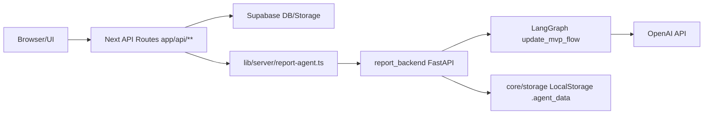
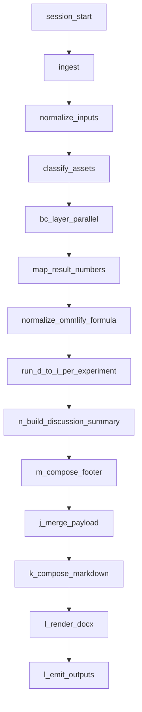

# Backend Dependency Map

最終更新日: 2026-02-25  
対象: `update_UI` のサーバー実行層（Next API/BFF + `report_backend` FastAPI）

---

## 1. バックエンドの層構成

---

## 2. Next API (BFF) 依存

### 2.1 Reports系ルート

パス:

- `/api/reports/generate`
- `/api/reports/prepare`
- `/api/reports/extract`
- `/api/reports/regenerate/from-cache`
- `/api/reports/regenerate/from-json`
- `/api/reports/cancel`
- `/api/reports/{id}/analysis`
- `/api/reports/{id}/analysis/quant-comment`
- `/api/reports/{id}/agent-progress`
- `/api/reports/{id}/experimental-results/stream`
- `/api/reports/{id}/diagnostics`

共通依存:

- `app/api/reports/_shared/access.ts`
  - `getUserIdFromRequest`
  - `loadOwnedReport`
- `app/api/reports/_shared/report-action.ts`
  - 共通実行ラッパ（JSON parse / auth / 409 handling / error status 更新）

### 2.2 Stripe/通知/フィードバック

- `app/api/stripe/*` -> `lib/stripe/client.ts`, Supabase `profiles/subscriptions/credit_transactions`
- `app/api/notifications/route.ts` -> Supabase `notifications`
- `app/api/feedback/route.ts` -> Supabase `feedback`

---

## 3. Node Orchestrator (`report-agent.ts`) 依存分割

Step 6 で `lib/server/report-agent.ts` は責務分割済み。  
現在の依存は以下。

| モジュール | 主責務 | 主な依存先 |
|---|---|---|
| `report-agent.ts` | Run/Prepare/Render オーケストレーション | 下記モジュール全体 |
| `report-agent/agent-client.ts` | FastAPI HTTP クライアント (`/jobs/*`, `/render`) | `fetch`, `undici.Agent` |
| `report-agent/storage.ts` | Supabase Storage/DB 更新、ロック、ログ | `createServiceClient`, `reports/job_logs` |
| `report-agent/excel-assets.ts` | Excel画像抽出・テーブル抽出補助 | `xlsx`, `pizzip`, LibreOffice, Storage |
| `report-agent/analysis.ts` | 進捗payload、fallback analysis、編集反映 | JSON shaping |
| `report-agent/file-utils.ts` | MIME/CSV/ファイル名正規化 | `path` |
| `report-agent/errors.ts` | `ReportAlreadyProcessingError` など | エラー型定義 |

---

## 4. Report Backend (FastAPI) 依存

### 4.1 エントリポイント

- `report_backend/app/main.py`
  - `load_settings()` (`core/config.py`)
  - `build_storage()` (`core/storage.py`)
  - `LLMClient` (`llm/client.py`)
  - `build_router()` (`app/api/routes_jobs.py`)

### 4.2 APIハンドラ

- `report_backend/app/api/routes_jobs.py` が主ルータ
- 主なエンドポイント:
  - `POST /jobs`
  - `POST /jobs/{id}/images`
  - `POST /jobs/{id}/tables`
  - `POST /jobs/{id}/excel`
  - `POST /jobs/{id}/past-report`
  - `POST /jobs/{id}/run?mode=...`
  - `GET /jobs/{id}`
  - `GET /jobs/{id}/intermediate`
  - `GET /jobs/{id}/artifact`
  - `POST /render`
  - `POST /experimental-results/stream`

`routes_jobs.py` の主要依存:

- `core.jobs`（state load/save）
- `graph.build_graph`
- `graph.state`（AgentState定義）
- `llm.client`
- `templating.renderer`

### 4.3 グラフ実行

- `graph/build_graph.py`
  - 既定モード `update_mvp` で `build_graph_update_mvp(...)` を返す
- `graph/update_mvp_flow/build_graph_update_mvp_flow.py`
  - A -> B/C -> D-I -> N -> M -> J -> K -> L
  - HITL分岐あり（`create_hitl_request` -> `wait_for_hitl_response`）
- `graph/update_mvp_flow/nodes.py`
  - `NODE_SOURCE_MAP` にノードと実装元を集約

---

## 5. データ・ストレージ依存（Backend）

### 5.1 Supabase（Next BFF側）

- テーブル: `reports`, `experiment_data`, `job_logs`, `profiles`, `subscriptions`, `credit_transactions`, `notifications`, `feedback`
- バケット: `experiment-files`

### 5.2 FastAPI側ストレージ

- 現状 `core/storage.py` は `LocalStorage` 実装のみ有効
- 実体は `report_backend/.agent_data/**`
- `jobs/{job_id}/state.json` が状態の正

---

## 6. バックエンド高結合ポイント

- `app/api/routes_jobs.py`（エンドポイント集約・責務多い）
- `lib/server/report-agent.ts`（BFFとFastAPIの境界オーケストレータ）
- `graph/build_graph.py`（モード切替とノード import 集中）

---

## 7. 更新ルール（Backend）

次の変更があったらこのファイルを更新すること。

1. `app/api/**` ルート追加・削除・責務変更
2. `lib/server/report-agent.ts` / `lib/server/report-agent/**` の分割・統合
3. `report_backend/app/api/routes_jobs.py` の endpoint 追加・削除
4. `graph/update_mvp_flow/build_graph_update_mvp_flow.py` のノード順/分岐変更
5. `core/config.py` の主要設定キー追加
6. Supabase テーブル/Storageキーの追加・変更

更新時の最小作業:

1. このファイルの「最終更新日」を更新
2. 該当層（Next API / report-agent / FastAPI graph）の節を更新
3. `docs/PROGRAM_DEFINITION.md` の全体図または責務表に反映

