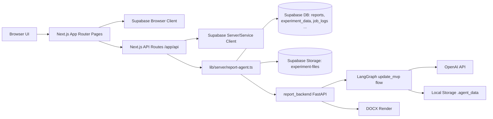

# Program Definition (Single Source of Truth)

最終更新日: 2026-02-25

このドキュメントは `update_UI` 全体の「入口」です。  
詳細な依存関係は次の2つを参照します。

- `docs/FRONTEND_DEPENDENCY_MAP.md`
- `docs/BACKEND_DEPENDENCY_MAP.md`

---

## 1. システム全体像

---

## 2. 実行責務の分担

| 層 | 主責務 | 主要パス |
|---|---|---|
| Frontend (Browser) | 画面表示、入力、進捗UI、一部Supabase直接操作 | `app/**`, `components/**` |
| BFF (Next API) | 認証/認可、DB操作、report-agent呼び出し、Stripe受け口 | `app/api/**` |
| Orchestrator (Node) | レポート生成前処理、FastAPI連携、成果物保存 | `lib/server/report-agent.ts` |
| Report Backend (Python) | ジョブ管理、LangGraph実行、Markdown/DOCX生成 | `report_backend/app/**`, `report_backend/graph/**` |

---

## 3. 主要ドメインデータ

### Supabaseテーブル（現行コード参照）

- `reports`
- `experiment_data`
- `job_logs`
- `profiles`
- `subscriptions`
- `credit_transactions`
- `notifications`
- `feedback`
- `support_tickets`

### Supabase Storageバケット

- `experiment-files`

主な保存キー:

- `/{userId}/{reportId}/analysis/analysis.json`
- `/{userId}/{reportId}/agent/progress.json`
- `/{userId}/{reportId}/artifact/report_*.docx`
- `/{userId}/{reportId}/experiment-data/**`

---

## 4. 代表フロー

### 4.1 レポート生成（新規/再生成キャッシュ）

1. UI (`/dashboard/reports/new` or `/dashboard/reports`) が `/api/reports/generate` or `/api/reports/regenerate/from-cache` を呼ぶ
2. Next API が `runReportAgentFromSupabaseReport` を実行
3. `report-agent.ts` が入力ファイル整形、FastAPI `/jobs/*` 実行、進捗保存
4. FastAPI が LangGraph `update_mvp` を実行し成果物を返す
5. Node側が docx を Supabase Storage に保存し `reports` を `completed` に更新

### 4.2 事前抽出 → 手編集 → JSON再生成

1. UI が `/api/reports/prepare` を呼ぶ
2. `prepareReportAgentFromSupabaseReport` が `analysis.json` を作成
3. UI が `/api/reports/{id}/analysis` を読み書き
4. UI が `/api/reports/regenerate/from-json` を呼び `renderReportFromSupabaseAnalysis` 実行

---

## 5. 参照すべき関連ドキュメント

- `docs/FRONTEND_DEPENDENCY_MAP.md`
- `docs/BACKEND_DEPENDENCY_MAP.md`
- `docs/REPORT_BACKEND_ENV_VARS.md`
- `docs/dependency-audit-2026-02-25.md` (監査スナップショット)

---

## 6. 運用ルール（必須）

以下の変更が入ったら、このファイルと FE/BE 依存マップを同時更新すること。

- 画面追加/削除、主要画面のAPI呼び先変更
- `app/api/**` の新規追加・削除・責務変更
- `lib/server/report-agent.ts` または `lib/server/report-agent/**` の責務変更
- `report_backend/app/api/routes_jobs.py` のエンドポイント追加/変更
- `report_backend/graph/update_mvp_flow/**` のノード順/分岐変更
- 新しい Supabase テーブル・Storageキー・環境変数の追加

更新時チェック:

1. `docs/PROGRAM_DEFINITION.md` の「最終更新日」を更新
2. FE/BEどちらに影響したかを依存マップへ反映
3. 変更箇所のパスを1行で追記（履歴節または該当表）

